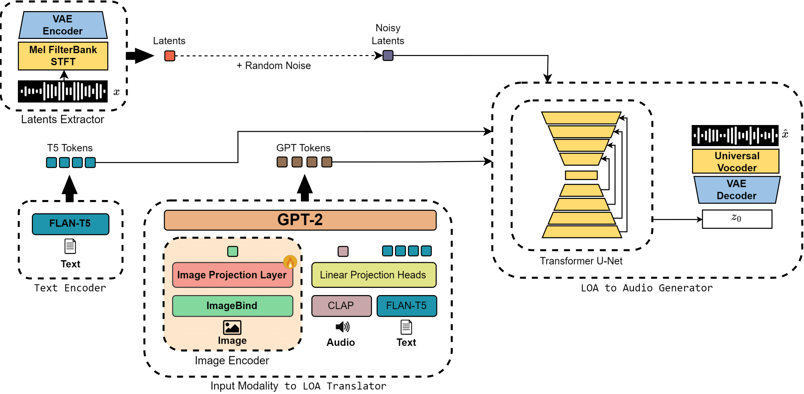

Artificial Intelligence has transformed music creation by using generative models that respond to textual or visual prompts. Current image-to-music models are limited to basic images, unable to handle complex digital artworks. To address this gap, we propose Art2Mus, a novel model designed to create music from digitized artworks or text inputs. Art2Mus extends the AudioLDM 2 architecture, a text-to-audio model, and employs our newly curated datasets, created via ImageBind, which pair digitized artworks with music. Experimental results show that Art2Mus generates music that resonates with the input stimuli, suggesting potential applications in multimedia art, interactive installations, and AI-driven creative tools.

