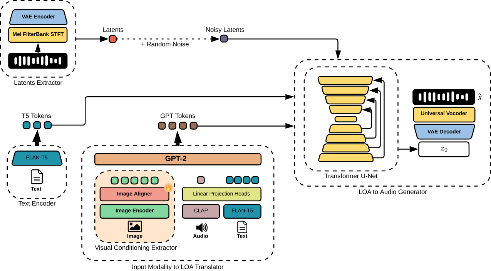

Music generation has advanced markedly through multimodal deep learning, enabling models to synthesize audio from text and, more recently, from images. However, existing image-conditioned systems suffer from two fundamental limitations: (i) they are typically trained on natural photographs, limiting their ability to capture the richer semantic, stylistic, and cultural content of artworks; and (ii) most rely on an image-to-text conversion stage, using language as a semantic shortcut that simplifies conditioning but prevents direct visual-to-audio learning. Motivated by these gaps, we introduce ArtSound, a large-scale multimodal dataset of 105,884 artwork-music pairs enriched with dual-modality captions, obtained by extending ArtGraph and the Free Music Archive. We further propose ArtToMus, the first framework explicitly designed for direct artwork-to-music generation, which maps digitized artworks to music without image-to-text translation or language-based semantic supervision. The framework projects visual embeddings into the conditioning space of a latent diffusion model, enabling music synthesis guided solely by visual information. Experimental results show that ArtToMus generates musically coherent and stylistically consistent outputs that reflect salient visual cues of the source artworks. While absolute alignment scores remain lower than those of text-conditioned systems-as expected given the substantially increased difficulty of removing linguistic supervision-ArtToMus achieves competitive perceptual quality and meaningful cross-modal correspondence. This work establishes direct visual-to-music generation as a distinct and challenging research direction, and provides resources that support applications in multimedia art, cultural heritage, and AI-assisted creative practice.

