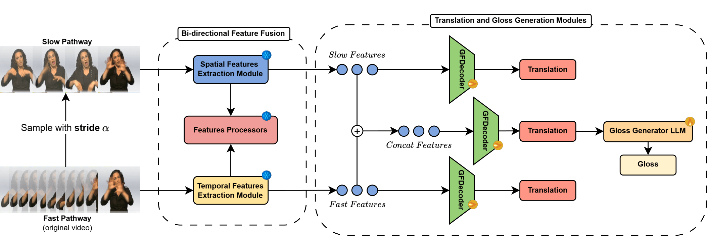

Sign language translation systems traditionally rely on intermediate gloss representations to bridge the gap between visual input and written language output. However, manual gloss annotation is costly, language-dependent, and often lossy, prompting growing interest in gloss-free alternatives. This paper introduces Handscribe, a novel two-stage framework for gloss-free sign language translation and gloss sequence generation. Handscribe first translates continuous sign language videos into written language sentences using a lightweight decoder built atop SlowFast-based spatiotemporal features and a frozen mBART model. Then, in the second stage, it generates gloss sequences from these sentences using a Large Language Model (LLaMa3.1-8B-Instruct) that has been fine-tuned with weak supervision. Our experiments on PHOENIX-2014-T and Wav2Gloss Fieldwork demonstrate strong translation performance and state-of-the-art multilingual gloss generation, even in zero-shot settings. The proposed framework reduces annotation bottlenecks while maintaining flexibility and interpretability, paving the way for scalable and inclusive sign language technologies.

