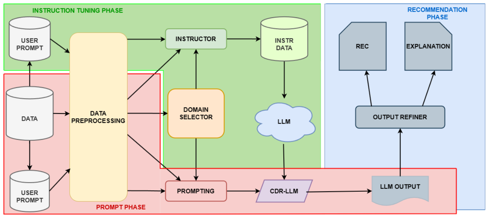

We present a method for using large language models (LLMs) to provide explainable cross-domain recommendations despite data scarcity. It involves instructing an LLM, creating personalized prompts, and processing responses to generate and explain recommendations. Experimental results show this approach outperforms existing methods.

